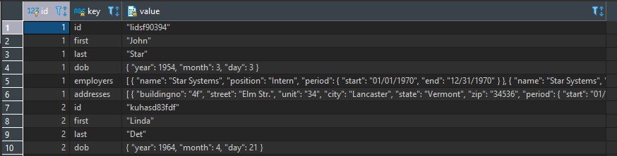

# JSON Parse Business Queries

#### Get JSON value from JSON object or array

Get first employer for person (-> Get as JSON; ->> Get as TEXT):

```
select
	prs.id,
	prs.person_data -> 'employers' -> 0 ->> 'name',
	prs.person_data_b -> 'employers' -> 0 ->> 'name'
from person as prs;
```

# JSON Parse Queries

#### Break first level of JSON into Key and Value columns:

```
select prs.id, (json_each(prs.person_data)).*
from person as prs;
```

Same result can be arhieved using implicit laterl join:

```
select prs.id, KeyValueOfJson.key, KeyValueOfJson.value
from person as prs, json_each(prs.person_data) as KeyValueOfJson;
```
