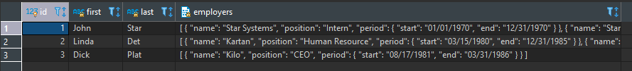

# Parse JSON

#### Get JSON value from JSON object or array

Get first employer for person (-> Get as JSON; ->> Get as TEXT):

```
select
	prs.id,
	prs.person_data ->> 'first' as "First Name",
	prs.person_data ->> 'last' as "Last Name",
	prs.person_data -> 'employers' -> 0 ->> 'name' as "First Employer"
from person as prs;
```

Same result can be archieved using json_extract_path/jsonb_extract_path and json_extract_path_text/jsonb_extract_path_text functions:

```
select
	prs.id,
	json_extract_path_text(prs.person_data, 'first') as "First Name",
	json_extract_path_text(prs.person_data, 'last') as "Last Name",
	json_extract_path_text(prs.person_data, 'employers', '0', 'name') as "First Employer"
from person as prs;
```



#### Break first level of JSON into Key and Value columns:

Use json_each/jsonb_each to break JSON into table with 2 columns: key, value. (Use json_each_text/jsonb_each_text to convert value column to text):

```
select prs.id, (json_each(prs.person_data)).*
from person as prs;
```

Same result can be arhieved using implicit laterl join:

```
select prs.id, KeyValueOfJson.key, KeyValueOfJson.value
from person as prs, json_each(prs.person_data) as KeyValueOfJson;
```

